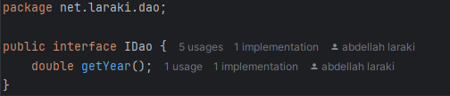
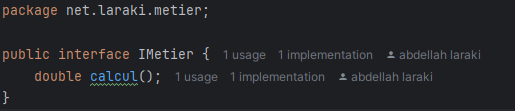
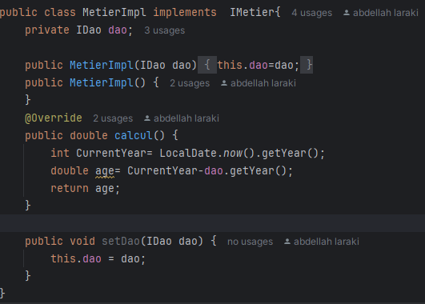
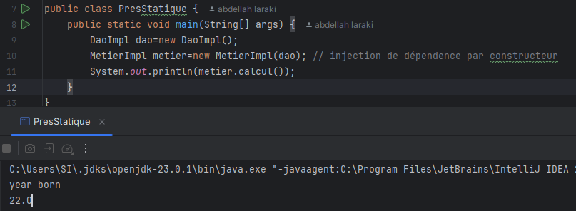
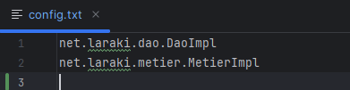
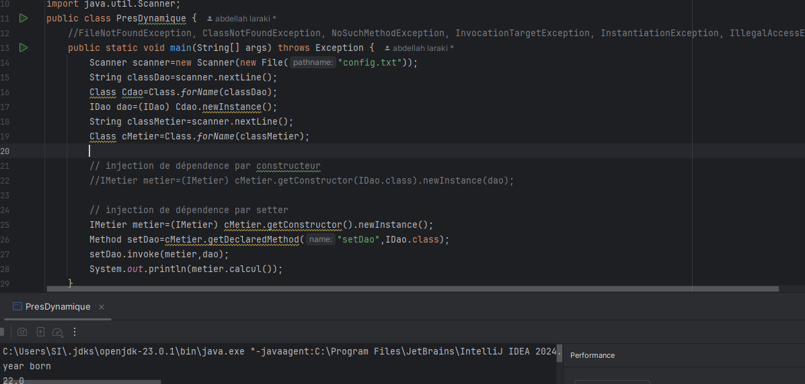

<h1>Dependency injection</h1>

<h1>Couche Dao</h1>
<h3>Interface IDao</h3>

<h3>Class DaoImpl</h3>

<h1>Couche Metier</h1>
<h3>Interface IMetier</h3>

<h3>Class MetierImpl</h3>

<h1>Couche Presentation</h1>
<h3>Présentation Statique</h3>

<h3>Présentation Dynamique</h3>
<h5>fichier config.txt</h5>

